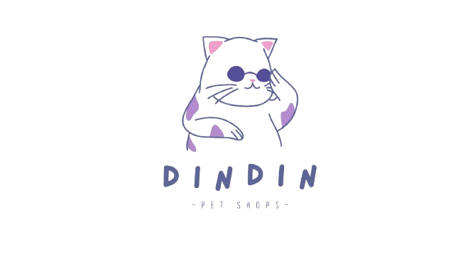
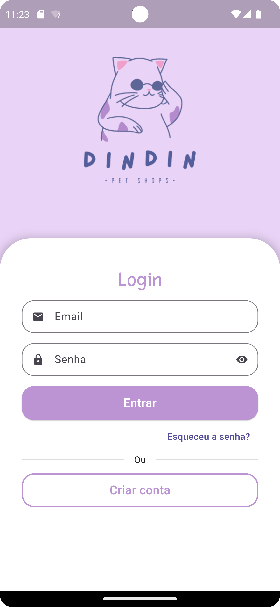
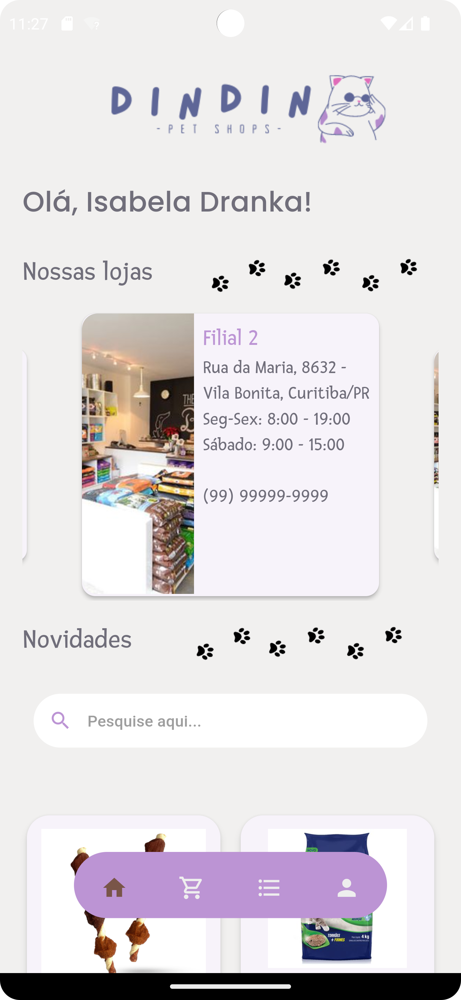
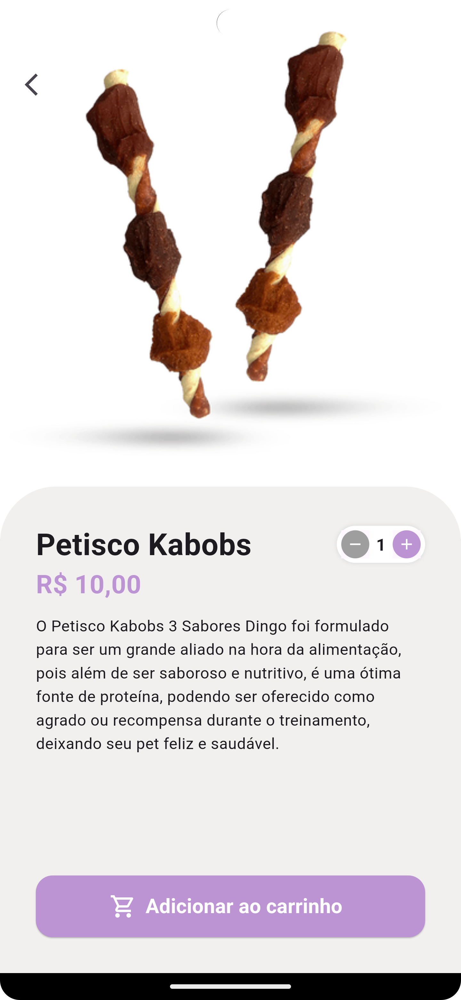
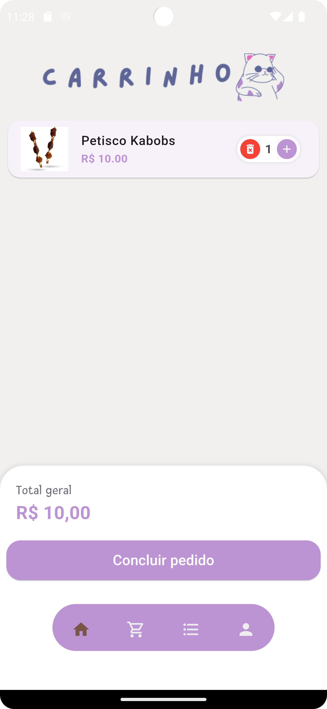

# Dindin Petshop

<p align="center">
  
</p>

## 💡 Sobre o Projeto

O **Dindin Petshop** é um aplicativo para um petshop que permite aos usuários explorar produtos, adicionar itens ao carrinho e gerenciar suas compras. O projeto foi desenvolvido utilizando tecnologias modernas para autenticação e gerenciamento de estado, e, também com foco em UX/UI, .

## 📱 Demonstração

Abaixo estão algumas telas do aplicativo:

<p align="center">
  
  
</p>

<p align="center">
  
  
</p>

- **Imagem 1**: Tela de login.
- **Imagem 2**: Tela inicial do petshop com a lista de produtos.
- **Imagem 3**: Detalhes do produto.
- **Imagem 4**: Tela do carrinho de compras.

## 🚀 Funcionalidades

- 🐕 **Autenticação com Google Firebase**: Cadastro e login de usuários utilizando autenticação do Google.
- 📦 **Gerenciamento de Produtos**: Exibição de produtos com detalhes e preços.
- 🛒 **Carrinho de Compras**: Adição e remoção de produtos do carrinho, com visualização dos itens selecionados.
- 🗂️ **Banco de Dados Realtime**: Armazenamento e sincronização de dados de produtos e usuários em tempo real.

## 🛠️ Tecnologias Utilizadas

- [Flutter](https://flutter.dev/) (Framework principal)
- [Dart](https://dart.dev/) (Linguagem de programação)
- [Dio](https://pub.dev/packages/dio) (Consumo de API)
- [GetX](https://pub.dev/packages/get) (Gerenciamento de estado)
- [Firebase Authentication](https://firebase.google.com/docs/auth) (Autenticação)
- [Firebase Realtime Database](https://firebase.google.com/docs/database) (Banco de dados em tempo real)
- [Signals](https://pub.dev/packages/signals) (Gerenciamento de eventos)

## 🛠️ Como Rodar o Projeto

Para rodar o projeto localmente, siga os seguintes passos:

1. Clone este repositório:
   ```bash
   git clone https://github.com/seu-usuario/dindin-petshop.git

2. Acesse a pasta do projeto:
   ```bash
     cd dindin-petshop

3. Configure o Firebase:

Siga as instruções no documento oficial do Firebase para configurar o Firebase Authentication e o Firebase Realtime Database.
Adicione o arquivo google-services.json (para Android) ou GoogleService-Info.plist (para iOS) ao seu projeto Flutter.

4. Instale as dependências:
   ```bash
    flutter pub get

5. Execute o aplicativo:
   ```bash
    flutter run
